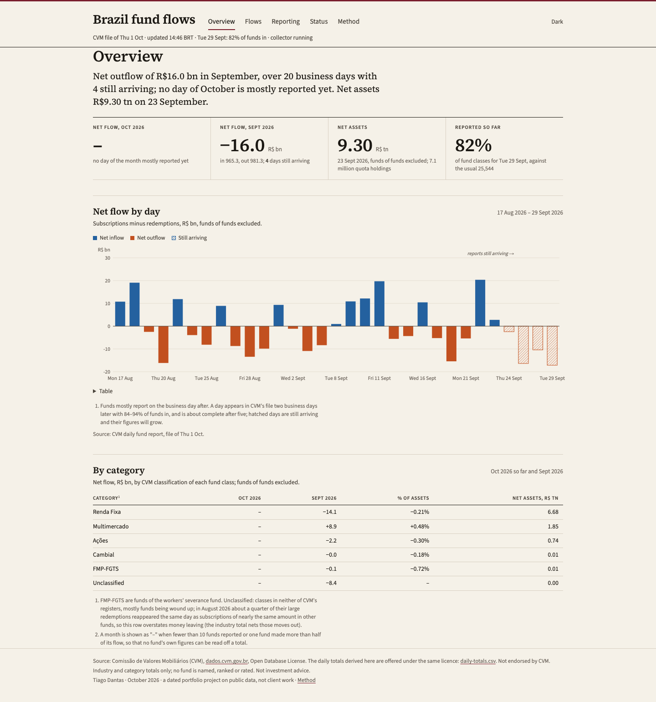

# fund-flows-br

**Nowcasting under reporting delays, on live public data; built, backtested and taken offline.**
Money in and out of Brazil's investment funds from CVM's daily report, a nowcast of each day's
final totals before CVM has received every fund's report, and a backtest, under rules committed
before it ran, of how good such a nowcast can be.

**The finding.** Two business days after a day, CVM's file holds 84–94% of fund classes. Its own
sum is already within about R$1.4 billion of the final net flow on an average day (1.5 basis points
of the industry's net assets, against a median daily net flow of about R$8 billion), and none of
five nowcasting methods, including a LightGBM model trained on 906,535 missing fund-days, improves
on it by a margin the data can tell from noise. The value of a nowcast lies in its interval and in
the record of how fast the figures settle, not in a better point.

The site ran on Railway on 1 October 2026 and was taken offline the same evening to save hosting
costs. Everything runs locally; screenshots are in `docs/screenshots/`.



## What this project covers

| Area | Where |
|---|---|
| Scheduled collection of every version of CVM's monthly files, conditional downloads, first and latest values kept per fund-day with a change log | `src/flows/collect.py`, `db.py`, `scheduler.py` |
| Rebuilding what a past morning's file held, from the delivery log; verified to the fund-day | `src/flows/vintages.py`, DATA.md |
| Industry and category totals since 2021 with a small-cell rule (no fund is ever identifiable) | `src/flows/totals.py` |
| Five nowcasting methods for a day's final totals, from the plain sum to a per-fund model | `src/flows/nowcast.py` |
| An evaluation plan committed before any run, a development year, a one-shot frozen test, a pre-registered decision rule with a block bootstrap, frozen intervals | `docs/EVAL_PLAN.md`, `scripts/backtest.py`, `docs/backtest/` |
| A source-gap detector over 2021–2026 | `src/flows/gaps.py` |
| Five pages in a financial-daily style: Overview, Flows, Reporting, Status, Method | `web/` |

## The question

Funds send CVM a daily report, mostly on the business day after. CVM rewrites its monthly file
every morning with what has arrived, and more than half of the fund-days are later resubmitted.
So the latest days in the file are partial: on the morning of a business day, the day before is
under 1% in, the day before that 84–94% (about 93% of net assets), and 98–99.5% are in by the fifth
business day. Can the final totals be nowcast before the late reports arrive?

This is a nowcasting problem, not a forecasting one: the day is already past, and the task is to
estimate its final figure from the reports that have arrived so far, with an interval, and to be
graded when the figure settles. The same problem appears in epidemiology (cases by onset date
under reporting delays) and in official statistics (first estimates later revised).

## Data

CVM open data under the Open Database License, no key:

- **Daily report of investment funds** (`FI/DOC/INF_DIARIO`): per fund class and day, net assets,
  quota value, subscriptions, redemptions, quota holdings. Monthly files from 2021 here.
- **Delivery log** (`FI/DOC/ENTREGA`): every delivery of every daily report with its timestamp.
  A fund-day is in a morning's file exactly when its first delivery came before the file was
  written and a delivery is still active; this reproduced the published file on all 22 days
  checked (25,113 / 20,932 / 59 fund-days for 28–30 September 2026).
- **Fund register** (`FI/CAD`): category, fund-of-funds flag, administrator.

Facts, checks and the one source gap found (13–16 January 2026: 49 classes holding R$1.67 trillion
absent from CVM's file) are in `DATA.md`.

## How each nowcasting method is built

All methods see only the fund-days delivered before the morning file was written; the final file is
never consulted for what a method may know. A fund is expected if it reported on one of the
previous 10 business days; the truth is the membership 15 business days after the day.

| Method | How it is built |
|---|---|
| **reported** (the baseline) | the sum of what is in the file: what any reader sees |
| **scale_up** | within each category and fund-of-funds group, reported × expected net assets / present net assets, capped at 3 |
| **trailing** | reported + each missing fund's trailing 20-business-day mean rates × its last net assets |
| **trailing_beta** | trailing + a per-category response to the day's reported net flow, fitted by weighted least squares |
| **model** | reported + a LightGBM Tweedie model per leg (subscriptions, redemptions) of each missing fund's rate, weighted by net assets, 16 features (own trailing rates, size, days since seen, lag, month end, category, the category's same-day reported flows); power chosen on 2025 among 1.3, 1.5, 1.7; cross-fitted on purged weekly blocks |

Pre-registered rule: the model becomes the default only if its lag-2 net-flow error on the
headline segment is at least 10% below scale-up's, with a weekly block-bootstrap interval above
zero. Otherwise the default is the best of the simple methods. The script applies the rule.

## Results

Mean absolute error of net flow, headline segment (funds of funds excluded), R$ billion, by
business days after the day. Every method is scored on the same cells.

**Development year, 2025** (242 days): the rule's verdict, default **scale_up**; the model fails.

| Method | lag 2 | lag 3 | lag 4 | lag 5 |
|---|---:|---:|---:|---:|
| reported | **1.16** | 0.77 | 0.59 | 0.52 |
| scale_up | 1.20 | 0.79 | 0.60 | 0.53 |
| model (power 1.7) | 1.27 | 0.86 | 0.67 | 0.59 |
| trailing | 1.48 | 1.07 | 0.89 | 0.80 |
| trailing_beta | 1.45 | 1.07 | 0.90 | 0.80 |

**Frozen test, January–August 2026** (155 days; 16 January set aside as a gap day), scored once:

| Method | lag 2 | lag 3 | lag 4 | lag 5 |
|---|---:|---:|---:|---:|
| reported | 1.36 | **0.62** | **0.55** | **0.44** |
| scale_up | 1.42 | 0.67 | 0.59 | 0.47 |
| model (power 1.5) | **1.30** | 0.69 | 0.63 | 0.51 |
| trailing | 1.68 | 0.77 | 0.66 | 0.54 |
| trailing_beta | 1.69 | 0.77 | 0.65 | 0.54 |

Skill against scale_up at lag 2 on the test, with the bootstrap interval: model +0.09 [−0.06, +0.22],
reported +0.04 [−0.05, +0.13], trailing −0.18 [−0.37, −0.03]. In basis points of net assets the
lag-2 errors are 1.5–1.6 for every method but trailing (1.9). Funds that arrive without being
expected add about +0.3 billion of net flow at lag 2 that no method captures.

Intervals fitted on 2025 and applied unchanged to 2026 (scale_up): the 80% interval covered 80.6%
of net-flow cells and the 95% interval 98.1%, inside the targets set in the plan; they are wide at
lag 2 and tighter after, since they are pooled across lags.

What it means: the funds still missing two business days later hold about 5% of net assets, and
their inflows and outflows nearly cancel. There is little left to predict, and a model that tries
adds noise. Full numbers, the decision, diagnostics (cutoff sensitivity, truth definition) and the
pinned input hashes are in `docs/EVAL_PLAN.md` and `docs/backtest/`.

## Reproduce

```sh
uv sync
uv run python scripts/download.py --daily-from 202101 --deliveries-from 202501   # ~1.1 GB
uv run python scripts/checks.py --from 202401 --to 202609                         # DATA.md checks
uv run python scripts/gaps.py                                                     # source gaps
uv run python scripts/backtest.py --dev                                           # 2025, ~25 min
uv run python scripts/backtest.py --test --once                                   # once
uv run uvicorn flows.app:app                                                      # the pages, SQLite
uv run pytest
```

## Limits

- Development and test values are CVM's final values: which fund-days a morning held is exact,
  their figures at the time are not (resubmissions overwrite them). Live errors would be larger by
  the revisions.
- One register snapshot (October 2026) classifies every year.
- Receivables, real estate and private equity funds report elsewhere and are not covered.
- Industry and category totals only. No fund is named, ranked or rated; a day or month is hidden
  when fewer than 10 funds reported or one fund made more than half of its flow.

## Licence and attribution

Code under MIT. Data: Comissão de Valores Mobiliários (CVM), dados.cvm.gov.br, Open Database
License; the daily totals derived here are offered under the same licence by the app
(`/data/daily-totals.csv`). Fonts: Source Serif 4, Source Sans 3 and Source Code Pro (SIL OFL).
Not endorsed by CVM. Not investment advice.

A dated portfolio project by Tiago Dantas, October 2026, on public data. Not client work.
